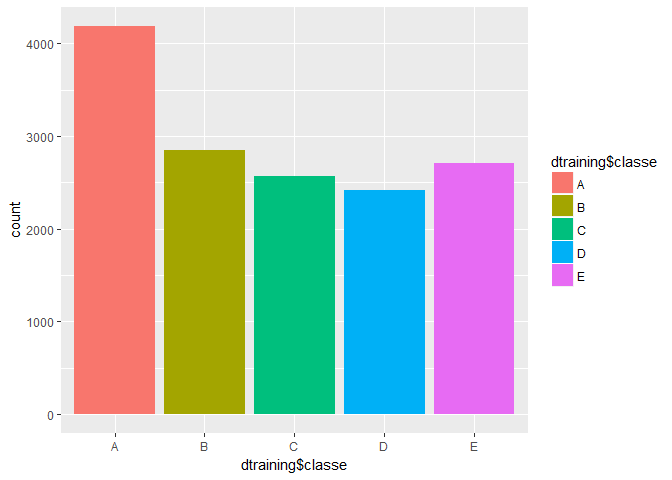

1.Background
------------

Using devices such as Jawbone Up, Nike FuelBand, and Fitbit it is now
possible to collect a large amount of data about personal activity
relatively inexpensively. These type of devices are part of the
quantified self movement - a group of enthusiasts who take measurements
about themselves regularly to improve their health, to find patterns in
their behavior, or because they are tech geeks. One thing that people
regularly do is quantify how much of a particular activity they do, but
they rarely quantify how well they do it. In this project, your goal
will be to use data from accelerometers on the belt, forearm, arm, and
dumbell of 6 participants. They were asked to perform barbell lifts
correctly and incorrectly in 5 different ways. More information is
available from the website here:
<http://groupware.les.inf.puc-rio.br/har> (see the section on the Weight
Lifting Exercise Dataset).

### Importing Required Packages:

    suppressMessages(library(rmarkdown))
    suppressMessages(library(knitr))

2.Getting data
--------------

Importing Data From the provided *Urls*

    dtrain <- read.csv(url("https://d396qusza40orc.cloudfront.net/predmachlearn/pml-training.csv"), stringsAsFactors = FALSE, na.strings = c(NA, "#DIV/0!"))
    dtest <- read.csv(url("https://d396qusza40orc.cloudfront.net/predmachlearn/pml-testing.csv"), stringsAsFactors = FALSE, na.strings = c(NA, "#DIV/0!"))
    dtest$problem_id <- NULL #We need to predict this at end

3.Data Discovery
----------------

    dim(dtrain)

    ## [1] 19622   160

Lets find out the columns having missing values. 100 columns are found
to be having missing values. Missingness was found to be 97.93% in all
these columns.So it is better to remove these columns from the
modelling.

4.Data Cleansing
----------------

    #data cleaning function:
    data_cleaning <- function(inputdata){
      #Removing Unnecessasary variables
      inputdata <- inputdata[, -(1:7)]
      #Deleting Missing Values:
      inputdata <- inputdata[!vapply(inputdata, anyNA, logical(1))]
    }
    dtrain <- data_cleaning(dtrain)
    dtest <- data_cleaning(dtest)
    #names(dtrain) To keep same names as in dtrain

    #Rounding numerical variales to reduce computational complexity
    num_vars <- names(dtrain)[sapply(dtrain,is.double)]
    for (i in num_vars){
      dtrain[,i] <- round(dtrain[,i],2)
    }
    num_vars <- names(dtest)[sapply(dtest,is.double)]
    for (i in num_vars){
      dtest[,i] <- round(dtest[,i],2)
    }
    dtrain$classe <- factor(dtrain$classe)
    #Create data partitions:
    suppressMessages(library(caret))
    intrain <- createDataPartition(dtrain$classe, p = 0.75, list = FALSE)
    dtraining <- dtrain[intrain,]
    dvalidation <- dtrain[-intrain,]
    rm(dtrain)

5.EDA
-----

    suppressMessages(library(ggplot2))
    qplot(dtraining$classe, geom = 'bar', fill = dtraining$classe)

### Inference:

Class A was found to be bit more frequently occured than remained
classes.

6.Preprocessing
---------------

    pre_proc <- preProcess(dtraining[, -53], 
                           method = c("center", "scale", "YeoJohnson","nzv"))
    dtraining_preproc <- predict(pre_proc, dtraining)
    dvalidation_preproc <- predict(pre_proc, dvalidation)
    dtest_preproc <- predict(pre_proc, dtest)

7.Modelling:
------------

### Lets start with rpart i.e Decision tree

    suppressMessages(library(rpart))
    rp <- rpart(classe ~ ., data=dtraining_preproc, method="class")
    pred_rp <- predict(rp, dvalidation_preproc,type = "class")
    confusionMatrix(pred_rp, dvalidation$classe)

    ## Confusion Matrix and Statistics
    ## 
    ##           Reference
    ## Prediction    A    B    C    D    E
    ##          A 1258  188   53   74   60
    ##          B   28  519   40   33   19
    ##          C   35   72  556   42   44
    ##          D   49   25  156  532   87
    ##          E   25  145   50  123  691
    ## 
    ## Overall Statistics
    ##                                           
    ##                Accuracy : 0.7251          
    ##                  95% CI : (0.7124, 0.7376)
    ##     No Information Rate : 0.2845          
    ##     P-Value [Acc > NIR] : < 2.2e-16       
    ##                                           
    ##                   Kappa : 0.6504          
    ##  Mcnemar's Test P-Value : < 2.2e-16       
    ## 
    ## Statistics by Class:
    ## 
    ##                      Class: A Class: B Class: C Class: D Class: E
    ## Sensitivity            0.9018   0.5469   0.6503   0.6617   0.7669
    ## Specificity            0.8931   0.9697   0.9523   0.9227   0.9143
    ## Pos Pred Value         0.7704   0.8122   0.7423   0.6266   0.6683
    ## Neg Pred Value         0.9581   0.8992   0.9280   0.9329   0.9457
    ## Prevalence             0.2845   0.1935   0.1743   0.1639   0.1837
    ## Detection Rate         0.2565   0.1058   0.1134   0.1085   0.1409
    ## Detection Prevalence   0.3330   0.1303   0.1527   0.1731   0.2108
    ## Balanced Accuracy      0.8975   0.7583   0.8013   0.7922   0.8406

### Modeling with RandomForest

    suppressMessages(library(randomForest))
    rf <- randomForest(classe ~ ., data=dtraining_preproc, method="class")
    pred_rf <- predict(rf, dvalidation_preproc,type = "response")
    confusionMatrix(pred_rf, dvalidation$classe)

    ## Confusion Matrix and Statistics
    ## 
    ##           Reference
    ## Prediction    A    B    C    D    E
    ##          A 1395    3    0    0    0
    ##          B    0  946    7    0    0
    ##          C    0    0  847   11    0
    ##          D    0    0    1  792    0
    ##          E    0    0    0    1  901
    ## 
    ## Overall Statistics
    ##                                         
    ##                Accuracy : 0.9953        
    ##                  95% CI : (0.993, 0.997)
    ##     No Information Rate : 0.2845        
    ##     P-Value [Acc > NIR] : < 2.2e-16     
    ##                                         
    ##                   Kappa : 0.9941        
    ##  Mcnemar's Test P-Value : NA            
    ## 
    ## Statistics by Class:
    ## 
    ##                      Class: A Class: B Class: C Class: D Class: E
    ## Sensitivity            1.0000   0.9968   0.9906   0.9851   1.0000
    ## Specificity            0.9991   0.9982   0.9973   0.9998   0.9998
    ## Pos Pred Value         0.9979   0.9927   0.9872   0.9987   0.9989
    ## Neg Pred Value         1.0000   0.9992   0.9980   0.9971   1.0000
    ## Prevalence             0.2845   0.1935   0.1743   0.1639   0.1837
    ## Detection Rate         0.2845   0.1929   0.1727   0.1615   0.1837
    ## Detection Prevalence   0.2851   0.1943   0.1750   0.1617   0.1839
    ## Balanced Accuracy      0.9996   0.9975   0.9940   0.9924   0.9999

### Inference:

Decision tree algorithm performed well and showed **0.72** accuracy. But
RandomForest showed better performance than decision tress as it has
accuracy **0.99**

<table>
<thead>
<tr class="header">
<th>Models</th>
<th>Accuracy</th>
<th>Error</th>
</tr>
</thead>
<tbody>
<tr class="odd">
<td>Decision Tree</td>
<td>0.72</td>
<td>1 - 0.72 = 0.28</td>
</tr>
<tr class="even">
<td>RandomForest</td>
<td>0.99</td>
<td>1 - 0.99 = 0.01</td>
</tr>
</tbody>
</table>

8.Final Prediction
------------------

Since we got better performance with Radomforests we can predict the
test values using it.

    suppressMessages(library(randomForest))
    final_predictions <-  predict(rf, dtest_preproc,type = "response")
    final_predictions

    ##  1  2  3  4  5  6  7  8  9 10 11 12 13 14 15 16 17 18 19 20 
    ##  B  A  B  A  A  E  D  B  A  A  B  C  B  A  E  E  A  B  B  B 
    ## Levels: A B C D E

9.Conclusion
------------

-   Using the given url data was loaded into R.
-   There found many missing values in some variables, all those values
    are later deleted
-   Data was made some transformations like "center", "scale",
    "YeoJohnson" and "nzv".
    -   "YeoJohnson": To make data more or less normal distribution
    -   "center" and "scale": To avoid dominance of larger values
    -   "nzv": To remove Near zero variance variables
-   Two model are performed "Decision Tree" and "FandomForest".
-   Randomforest model was finalized and predictions were made using it.
