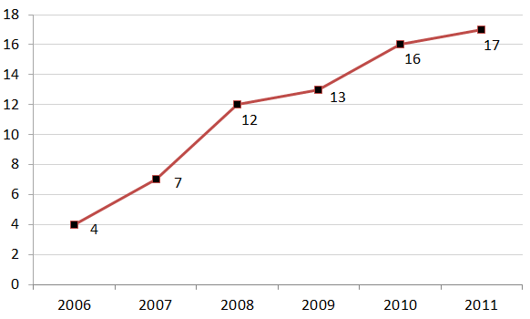

# Prediction-Assignment-Writeup
## Human Activity Recognition

Human Activity Recognition - HAR - has emerged as a key research area in the last years and is gaining increasing attention by the pervasive computing research community  (see picture below, that illustrates the increasing number of publications in HAR with wearable accelerometers), especially for the development of context-aware systems.  There are many potential applications for HAR, like: elderly monitoring, life log systems for monitoring energy expenditure and for supporting weight-loss programs, and  digital assistants for weight lifting exercises.

## Weight Lifting Exercises Dataset

This human activity recognition research has traditionally focused on discriminating between different activities, i.e. to predict "which" activity was performed at a  specific point in time (like with the Daily Living Activities dataset above). The approach we propose for the Weight Lifting Exercises dataset is to investigate "how (well)"  an activity was performed by the wearer. The "how (well)" investigation has only received little attention so far, even though it potentially provides useful information for  a large variety of applications,such as sports training.

In this work (see the paper) we first define quality of execution and investigate three aspects that pertain to qualitative activity recognition: the problem of specifying  correct execution, the automatic and robust detection of execution mistakes, and how to provide feedback on the quality of execution to the user. We tried out an on-body  sensing approach (dataset here), but also an "ambient sensing approach" (by using Microsoft Kinect - dataset still unavailable).

Six young health participants were asked to perform one set of 10 repetitions of the Unilateral Dumbbell Biceps Curl in five different fashions: exactly according to the  specification (Class A), throwing the elbows to the front (Class B), lifting the dumbbell only halfway (Class C), lowering the dumbbell only halfway (Class D) and throwing  the hips to the front (Class E).

Class A corresponds to the specified execution of the exercise, while the other 4 classes correspond to common mistakes. Participants were supervised by an experienced weight lifter to make sure the execution complied to the manner they were supposed to simulate. The exercises were performed by six male participants aged between 20-28 years, with little weight lifting experience. We made sure that all participants could easily simulate the mistakes in a safe and controlled manner by using a relatively light dumbbell (1.25kg).

